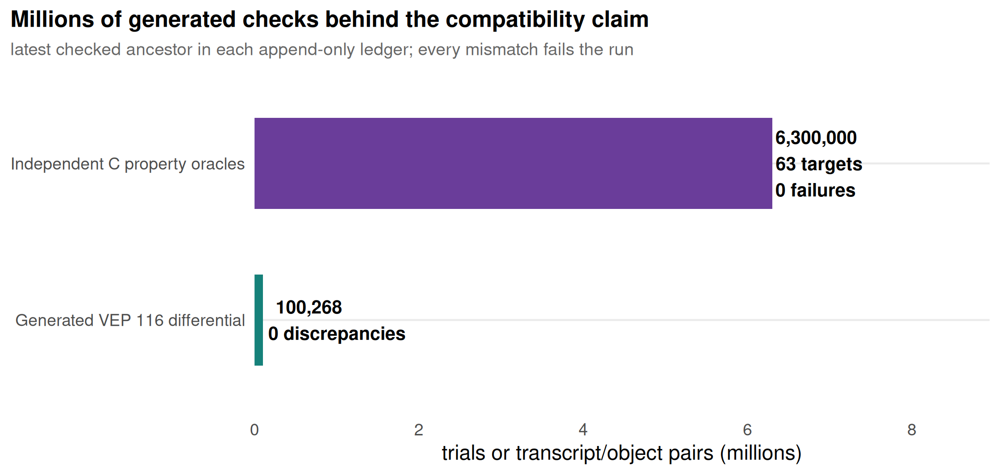

DuckVEP and FastVEP: compact and complete-field benchmarks
================

<!-- benchmark_duckvep_fastvep.md is generated from benchmark_duckvep_fastvep.Rmd. Do not edit the .md by hand. -->

Status: revision-labelled measured comparison of DuckVEP and FastVEP on
the complete GIAB HG002 GRCh38 small-variant benchmark VCF. Compact and
complete-field workloads have separate contracts and source revisions.
Measurements include decoding and real uncompressed output; DuckVEP also
performs an explicit coordinate sort. Complete CSQ includes HGVS.
Supplementary annotation is measured separately.

## The short answer

Performance depends on the output contract. The [complete-field
measurements](#complete-field-contracts) compare native tab and common
CSQ with FastVEP revision `18177c26a0d1d2419fe43c3e8f6d4a0b5c4a3eb6`
(September 10, 2026), using a cache rebuilt from DuckVEP’s exact
644,427-transcript inventory. They retain all output rows and field
disagreements; they do not establish complete VEP parity. FastVEP is
faster in both complete-field workloads at one and four cores in this
retained matrix. These are end-to-end pipeline measurements, not
isolated kernel timings.

The compact baseline below uses FastVEP `7038e7c` (July 13, 2026). On
that declared workload, DuckVEP finished 2.55 times faster on one
physical core and 2.12 times faster on four, with four presentation
fields left as placeholders. Those measurements do not rank the
complete-field pipelines. Ensembl VEP 116 remains the biological
authority.

## Compact-output baseline

Both tools start from the same compressed, coordinate-sorted GIAB VCF,
use the same Ensembl 116 GRCh38 reference product and 5,000-base
transcript window, run on the same pinned physical cores, and finish by
writing a real uncompressed 17-field tab file. The common denominators
are 4,048,342 source records and 4,096,123 source ALT alleles.

The comparison retains the work each tool actually requires:

- DuckVEP decodes the VCF through htslib, expands ALT alleles, maps
  contigs, performs an explicit global coordinate sort under a 4 GB
  DuckDB memory limit, annotates, joins transcript labels, and writes
  the result.
- FastVEP starts from the already sorted VCF, loads its native
  transcript cache, annotates, coordinates results, and writes its
  native tab schema.
- The output schemas have the same width but are not claimed
  byte-equivalent. FastVEP computes every field in its native
  presentation schema. DuckVEP pays for the explicit sort that FastVEP
  does not perform, but leaves `Codons`, `Existing_variation`,
  `DISTANCE`, and `FLAGS` as placeholders in this speed comparison.

This is therefore an operational pipeline comparison, not an
isolated-kernel microbenchmark.

### Presentation work is not free

The 17 FastVEP columns are not one indivisible kernel. DuckVEP already
produces the consequence, impact, cDNA/CDS/protein positions, amino
acids, and numeric transcript/gene ordinals. The measured DuckDB query
derives the uploaded variant, location, allele, and feature type, then
joins stable gene and transcript identifiers plus strand from the
resident model.

The four placeholders have different status:

| FastVEP field        | DuckVEP route                                                                                                                                     | Included here? |
|:---------------------|:--------------------------------------------------------------------------------------------------------------------------------------------------|:---------------|
| `Existing_variation` | exact allele join to dbSNP, ClinVar, or another named-variant relation                                                                            | No             |
| `DISTANCE`           | one validated projection from VEP feature geometry and transcript endpoints; SQL may render the resulting number                                  | No             |
| `FLAGS`              | join requested transcript attributes from the model relation                                                                                      | No             |
| `Codons`             | reconstruct reference/alternate triplets in `duckvep_transcript_projection`; the annotation kernel currently exposes only the scalar coding facts | No             |

Thus the comparison credits FastVEP for computing these native values.
It also shows where DuckVEP can obtain named-variant and transcript
metadata through ordinary joins without enlarging the consequence model.
The current complete-field adapter materializes annotations and calls
`duckvep_transcript_projection`, whose SQL reconstructs exon/CDS
geometry, codon windows and translation for each result. The
complete-field comparison below includes that projection. The compact
timings above do not measure it.

## Algorithm design: make the repeated biology small

DuckVEP compiles the Ensembl transcript, exon, CDS, regulatory, motif,
and reference inputs once into an immutable structure-of-arrays model.
Each DuckDB worker owns only mutable sweep cursors, sequence scratch,
output buffers, and its reference handle.

For sorted events, a start-ordered sweep admits each candidate
transcript or core feature once, expires it once, and reuses exon
cursors. The per-pair path keeps uploaded VCF geometry, VEP feature
geometry, and the minimized sequence edit distinct; projects the edit to
transcript/CDS coordinates; derives shared topology, splice,
sequence-delta, NMD, and compatibility facts; and evaluates a generated
VEP-116 SO rule program. Optional HGVS observes those same pair facts
instead of repeating candidate discovery. Numeric ordinals and masks
cross the hot loop; stable identifiers and display strings are joined
later.

That separation is the performance bet: C owns operations repeated for
every event/transcript pair, while DuckDB owns decoding, ordering, late
labels, provider joins, filtering, aggregation, and output. The measured
operator profile below tests the whole composition, not only the C loop.

## Supplementary annotation: fastSA versus DuckDB joins

FastVEP’s supplementary system deserves a direct result. The pinned
checkout (`7038e7c`) built a ClinVar `.osa` from the same dated
2026-07-06 VCF used by DuckDB. Both lookup systems then processed the
same 4,095,611 literal HG002 ALT alleles and returned the same 44,561
allele hits with the same requested ClinVar fields: significance, review
status, phenotypes, variant class, SO accession, and ExAC/1000
Genomes/ESP frequencies.

The timed region is deliberately staged for both systems:

- FastVEP’s real `SaReader` receives an already resident vector of
  allele tuples, performs its production 1,024-row preload/query
  pattern, and returns the complete JSON payload. Query-file parsing and
  `.osa` construction are outside the timer.
- DuckDB scans warm narrow Parquet query/provider relations, performs
  the collision-safe VariantKey join, reads every requested typed
  payload column, and folds a full payload hash. VCF decoding,
  normalization, and Parquet construction are outside the timer.

VariantKey-reversible alleles use the 64-bit key alone. Hashed keys
retain the literal chromosome, position, REF, and ALT refinement so a
hash collision cannot become clinical evidence. The FastVEP harness is
only an external benchmark adapter around its public reader; no Rust
provider was added to DuckHTS.

| system                    | threads | median seconds | queries/s  | runs |
|:--------------------------|--------:|:---------------|:-----------|-----:|
| DuckDB typed Parquet join |       1 | 0.899          | 4,556,237  |    5 |
| FastVEP fastSA lookup     |       1 | 3.422          | 1,196,778  |    5 |
| DuckDB typed Parquet join |       4 | 0.261          | 15,716,292 |    5 |
| FastVEP fastSA lookup     |       4 | 4.087          | 1,001,985  |    5 |


The one-core median is 0.90 seconds for DuckDB versus 3.42 seconds for
fastSA, a measured 3.81-fold ratio. At four cores the medians are 0.26
and 4.09 seconds, respectively. fastSA did not scale on this
shared-reader workload; the report records that observation without
extrapolating it to every fastSA source or cache layout.

### One SQL plan, several provider classes

ClinVar is not the composability claim. The checked DuckDB provider
campaign also measures the complete 71.70-million-row AlphaMissense v2
GRCh38 relation, the 77.97-million-row REVEL v1.3 GRCh37 relation, and a
real UCSC GRCh38 phyloP 100-way BigWig:

| workload                                            | assembly | provider rows | probe rows | result rows | threads | median seconds | probe rows/s |
|:----------------------------------------------------|:---------|:--------------|:-----------|:------------|--------:|:---------------|:-------------|
| ClinVar + ClinvArbitration + AlphaMissense one plan | GRCh38   | 79,617,268    | 4,036,258  | 4,036,328   |       1 | 3.257          | 1,239,256    |
| ClinVar + ClinvArbitration + AlphaMissense one plan | GRCh38   | 79,617,268    | 4,036,258  | 4,036,328   |       4 | 0.985          | 4,097,724    |
| REVEL v1.3 exact score join                         | GRCh37   | 77,966,138    | 4,103,497  | 4,103,497   |       1 | 3.224          | 1,272,797    |
| REVEL v1.3 exact score join                         | GRCh37   | 77,966,138    | 4,103,497  | 4,103,497   |       4 | 0.944          | 4,346,925    |
| AlphaMissense v2 exact score join                   | GRCh38   | 71,697,556    | 4,036,258  | 9,225       |       1 | 2.674          | 1,509,446    |
| AlphaMissense v2 exact score join                   | GRCh38   | 71,697,556    | 4,036,258  | 9,225       |       4 | 0.789          | 5,115,663    |
| phyloP 100-way BigWig full scan                     | GRCh38   | 9,314,560     | 9,314,560  | 9,314,560   |       1 | 0.994          | 9,370,785    |
| phyloP 100-way BigWig full scan                     | GRCh38   | 9,314,560     | 9,314,560  | 9,314,560   |       4 | 0.993          | 9,380,222    |
| phyloP 100-way BigWig 20 indexed ranges             | GRCh38   | 9,314,560     | 4,656,131  | 4,656,131   |       1 | 0.498          | 9,349,661    |
| phyloP 100-way BigWig 20 indexed ranges             | GRCh38   | 9,314,560     | 4,656,131  | 4,656,131   |       4 | 0.130          | 35,816,392   |


The GRCh38 all-in-one exact plan scans the GIAB case relation once and
joins ClinVar, ClinvArbitration, and AlphaMissense in 3.257 seconds on
one thread and 0.985 seconds on four. REVEL v1.3 is kept in its own
GRCh37 workload: combining its GRCh37 keys with the GRCh38 HG002 plan
would be fast but biologically false. The BigWig result decodes
9,314,560 stored phyloP intervals in 0.994 seconds on one thread; 20
independent indexed ranges scale from 0.498 to 0.130 seconds. The source
revisions and full receipts remain in [the exact/interval provider
report](benchmark_variantkey_join_overlap.md) and [the BigWig reader
report](benchmark_bigwig_reader.md).

### The composability bet

New supplementary annotation is normally a relation, not a new
consequence engine feature. A dated VCF can be expanded and keyed with
`read_bcf`; a tabix-indexed score file can be read by region;
AlphaMissense and REVEL can be projected into narrow Parquet;
BED/GFF/GTF and regulatory tables use exact half-open overlap; BigWig
and bedGraph provide dense signals; BAM can supply coverage or
supporting-read evidence; and gene constraints join on stable
identifiers. Anything DuckDB can scan—including Parquet, CSV/TSV, JSON,
Arrow, DuckLake, or a relation produced by another extension—can
participate without adding another C or Rust provider implementation to
DuckVEP.

This is not a claim that SQL makes every plan optimal automatically.
Exact alleles require assembly and normalization agreement; hashed
VariantKeys need literal refinement; intervals require chromosome
equality plus exact half-open inequalities; dense signals need declared
point/span reductions; and provider duplicates need an explicit
aggregation policy. Within those contracts, DuckDB supplies vectorized
scans, column projection, Parquet pushdown, parallel hash/range joins,
spill, aggregation, and output formats. The benchmark above measures
that bet instead of merely asserting it.

## Wall time: file in, 47 million rows out

| cores | DuckVEP |  FastVEP | FastVEP / DuckVEP |
|------:|--------:|---------:|------------------:|
|     1 | 64.54 s | 164.38 s |             2.55x |
|     4 | 32.06 s |  68.09 s |             2.12x |


On one pinned physical performance core, DuckVEP processed the full file
and wrote 47.63 million annotation rows in a median **64.54 seconds**
over three runs. Native FastVEP wrote 47.83 million rows in a median
**164.38 seconds** over three runs. The observed FastVEP/DuckVEP median
wall-time ratio is **2.55**.

That ratio describes these two native operational pipelines; it is not a
controlled engine-only speedup. DuckVEP enforces input order inside its
measured query and spills that sort under a 4 GB DuckDB memory limit,
while FastVEP trusts the already sorted VCF. FastVEP also computes
values for native tab fields that the current DuckVEP projection leaves
as placeholders. The exact times, row counts, and output widths are the
comparison; the report does not subtract either tool’s required work to
manufacture an artificial common kernel number.

### One-core details

| engine  | runs | median seconds | minimum seconds | maximum seconds | source records/s | source ALT alleles/s | output rows | output rows/s | median CPU % | maximum RSS GiB |
|:--------|-----:|---------------:|----------------:|----------------:|-----------------:|---------------------:|:------------|--------------:|-------------:|----------------:|
| DuckVEP |    3 |          64.54 |           63.75 |           66.44 |            62726 |                63466 | 47,629,345  |        737982 |           99 |            5.47 |
| FastVEP |    3 |         164.38 |          164.23 |          164.75 |            24628 |                24919 | 47,828,122  |        290961 |           99 |            3.17 |

The comparable rates use all 4,048,342 source records and all 4,096,123
source ALT alleles for both engines. DuckVEP annotates 4,095,611 literal
A/C/G/T/N alleles at 63,458 accepted alleles/s; 512 symbolic or
otherwise non-literal ALT alleles remain outside this particular
small-allele projection rather than disappearing from the shared source
denominator.

## Four-core comparison

The four-core comparison pins both processes to physical performance
cores 2, 4, 6, and 8. DuckVEP uses four DuckDB task threads while
retaining `decompression_threads := 0`; FastVEP uses four Rayon workers.
DuckVEP has three observations, while the FastVEP scaling point has one
and therefore no dispersion estimate.

| engine  | runs | median seconds | minimum seconds | maximum seconds | source ALT alleles/s | output rows/s | median CPU % | maximum RSS GiB |
|:--------|-----:|---------------:|----------------:|----------------:|---------------------:|--------------:|-------------:|----------------:|
| DuckVEP |    3 |          32.06 |           31.99 |           32.39 |               127764 |       1485631 |          251 |            5.57 |
| FastVEP |    1 |          68.09 |           68.09 |           68.09 |                60157 |        702425 |          239 |            3.17 |

DuckVEP’s four-thread median is **32.06 seconds**, versus **68.09
seconds** for FastVEP. The observed same-core-count wall-time ratio is
therefore **2.12** in DuckVEP’s favor. DuckVEP delivers a 2.01-fold
speedup over its one-thread median, or 50.3% elapsed-time parallel
efficiency, and reaches only 251% median aggregate CPU use. The measured
pipeline therefore remains limited by serial or partially parallel
reader, sort, coordination, or writer work rather than saturating four
cores with consequence computation.

The implementation contract shares the immutable resident model across
DuckDB workers while giving each worker its own mutable annotation
workspace. Measured maximum process RSS was 5.57 GiB at four threads,
versus 5.47 GiB at one. That process-level observation rules out a
fourfold increase in total RSS; it does not attribute individual
allocations to the model or worker workspaces.


DuckVEP’s measured advantage is not free: the immutable full transcript
model, worker state, DuckDB operators, and explicit sort put this
process near 5.5 GiB, versus 3.17 GiB for FastVEP. The model is shared
rather than copied per worker, which is why the one- and four-core
DuckVEP peaks are nearly flat. This report presents that tradeoff
directly instead of treating the DuckDB buffer-manager limit as total
process memory.

### Four-core operator profile

An additional diagnostic run used the same four-core command and real
output contract with DuckDB JSON profiling enabled. It recorded 29.68
seconds of query latency and 64.27 aggregate CPU-seconds, or 2.17 cores
averaged across the query. The six largest local operator CPU totals
were:

| stage                              | aggregate CPU seconds | output rows |
|:-----------------------------------|----------------------:|:------------|
| TSV COPY                           |                 16.59 | 1           |
| transcript-label hash join         |                 14.56 | 47,629,345  |
| annotation-list expansion / UNNEST |                  8.66 | 47,629,345  |
| 17-field text projection           |                  7.78 | 47,629,345  |
| sequential read_bcf scan           |                  4.34 | 4,048,342   |
| FILTER                             |                  2.86 | 4,095,611   |

These are aggregate operator CPU times, not additive wall-clock phases,
and do not by themselves prove which operator serialized a pipeline.
They do show that this query has no chromosome-per-worker scheduler:
DuckDB schedules vector-sized work around a global sort. The largest
measured costs are the 47.63-million-row transcript-label join, TSV
writer, annotation-list expansion, and final string projection. The
one-handle sequential VCF scan is visible but smaller. The observed 251%
median process utilization is therefore not a largest-chromosome tail,
and the end-to-end scaling ceiling is not attributable to the
consequence kernel alone.

If explicit genomic parallelism is introduced later, dynamically
scheduled coordinate tiles are preferable to one static task per
chromosome. Static chromosome tasks would create exactly the
chromosome-size and transcript-density tail that this current query does
not have.

## FastVEP scaling

FastVEP was compiled with `RUSTFLAGS='-C target-cpu=native'`; its
release profile also enables optimization level 3, fat LTO, and one
code-generation unit. `RAYON_NUM_THREADS` and `taskset` independently
control its worker count and CPU affinity. Only the six physical
performance cores were used; no SMT sibling or efficiency core was mixed
into this series.

| threads | seconds | ALT alleles/s | output rows/s | CPU % |  speedup | parallel efficiency % | maximum RSS GiB |
|--------:|--------:|--------------:|--------------:|------:|---------:|----------------------:|----------------:|
|       1 |  164.75 |         24863 |        290307 |    99 | 1.000000 |                 100.0 |            3.17 |
|       2 |  100.53 |         40745 |        475760 |   161 | 1.638814 |                  81.9 |            3.17 |
|       4 |   68.09 |         60157 |        702425 |   239 | 2.419592 |                  60.5 |            3.17 |
|       6 |   58.65 |         69840 |        815484 |   289 | 2.809037 |                  46.8 |            3.17 |

Six Rayon workers reduced wall time to 58.65 seconds, but consumed only
289% aggregate CPU and delivered 2.81 times the one-thread throughput.
The measured reader, ordered result coordinator, and writer therefore
limit scaling before six cores are saturated. This report does not
extrapolate that curve beyond the six homogeneous performance cores.
Each scaling point is one observation from the same sequence of runs;
unlike the one-core comparison, the scaling table has no repeated-run
dispersion estimate.

The six-core FastVEP wall time is 5.89 seconds shorter than the one-core
DuckVEP wall time. That is useful capacity information, but it is not a
same-core-count comparison; this report has no end-to-end six-core
DuckVEP row.

DuckDB was fixed at `PRAGMA threads=1` and the complete R worker was
pinned to CPU 2 for the one-core comparison. The four-core DuckVEP row
changes only `PRAGMA threads` and the affinity set. Neither row uses
htslib decompression threads, so the report does not relabel
decompression work as annotation parallelism.

## What was timed

Both comparisons begin with the same compressed, coordinate-sorted GIAB
VCF on the same local filesystem and end with a real uncompressed tab
file. The full file is intentionally read with
`scan_mode := 'sequential'`; indexed region subsetting is a separate
`read_bcf(...)` transport path and is not part of this whole-file
measurement.

DuckVEP includes:

1.  R, DuckDB, extension, and resident-model initialization;
2.  `read_bcf(..., scan_mode := 'sequential', decompression_threads := 0)`
    VCF decoding with no htslib worker pool;
3.  ALT expansion and chromosome-alias mapping;
4.  an explicit global order by sequence-region ordinal, position,
    record, and ALT ordinal;
5.  transcript candidate discovery and consequence annotation at a
    5,000-base transcript distance; and
6.  projection and `COPY` of 17 tab-separated fields to a real file.

FastVEP includes its process startup, cache load, VCF reader, transcript
candidate discovery, consequence annotation, ordered result handling,
and native 17-field tab writer. It consumes the already sorted VCF and
does not perform an explicit sort.

| tool    | output_contract       | row_count  | bytes         | lines      | observed_sha256                                                  | observed_runs | byte_order_stable |
|:--------|:----------------------|:-----------|:--------------|:-----------|:-----------------------------------------------------------------|--------------:|:------------------|
| duckvep | matched_tab_17_fields | 47,629,345 | 6,174,109,710 | 47,629,346 | cab3099378b4ccb0de4c2ecabc4cf6cac58c32aeb456015c8a6657782c24e8e3 |             6 | FALSE             |
| fastvep | native_tab_17_fields  | 47,828,122 | 6,376,454,054 | 47,828,124 | aec1d995ecd519e86f449372f4c9b6975f72dc9284afc16c646778e9c14d201f |             6 | TRUE              |

FastVEP’s tab schema is its native fixed 17-field projection. DuckVEP
matches the same physical column count and writes comparable text
volume, but it does not fabricate FastVEP-only presentation values such
as codon strings, flags, or existing-variation labels. The SHA-256 value
is an observed file receipt, not an assertion that the two engines write
identical text. FastVEP produced the same bytes in all six checked
thread/repeat observations. DuckVEP produced multiple byte orders across
6 observations because the final relational join has no output
`ORDER BY`. The historical receipt’s `hash(COLUMNS(*))` expression
expanded into separate column hashes, and its aggregate consumed only
the first, `Uploaded_variation`. That first-field order-independent
fingerprint over all 47,629,345 rows was identical in all 6 runs checked
for ID-multiset stability; it does not prove equality of the other 16
fields. Its first-field fingerprint is XOR 15135830789387217416,
low-32-bit sum 102267960154848972, and high-32-bit sum
102341672868090308. The current collector hashes `row(*COLUMNS(*))` and
labels its scope `full_row`. Mutation controls require sensitivity to
every field, NULLs and duplicate rows, while row permutation must
preserve the fingerprint. Historical receipt rows are retained
unchanged, not relabelled as full-row checks.

The FastVEP cache contains 645,457 transcripts; the exact VEP-filtered
DuckVEP model contains 644,427. The 1,030-transcript difference remains
visible in the output cardinalities and the VEP differential below. An
intersection-only performance or concordance denominator would conceal
it.

## Concordance against Ensembl VEP 116

Speed alone is not the compatibility contract. Both engines were
compared with the same Ensembl VEP 116 executable on a deterministic
held-out ClinVar chromosome-21 sample: 1,864 variants sampled by allele
shape with seed 113. The exact 113 KB sample is retained as
`benchmarks/data/duckvep_fastvep/clinvar_chr21_seed113.vcf`;
reproduction does not depend on regenerating it from an unrecorded
mutable source. VEP ran from its indexed cache with HGVS enabled.
FastVEP ran its recorded native binary with
`--hgvs --output-format vcf`. DuckVEP’s oracle Parquet came from the
same VEP run and the same resident model.

Here a transcript key means the exact
`(input variant ID, transcript accession)` pair emitted by a tool.
FastVEP’s internal candidate lookup calls a transcript “overlapping”
when its inclusive genomic span intersects the variant query expanded by
5,000 bases; that candidate pool is not the concordance denominator.
“Shared” below means that both the comparator and executable VEP
actually emitted the same transcript key.

| engine  | metric                              | result          | percent |
|:--------|:------------------------------------|:----------------|--------:|
| duckvep | union_keys                          | 56,998 / 56,998 | 100.000 |
| duckvep | shared_keys                         | 56,998 / 56,998 | 100.000 |
| duckvep | missing_keys                        | 0 / 56,998      |   0.000 |
| duckvep | extra_keys                          | 0 / 56,998      |   0.000 |
| duckvep | consequence_exact                   | 56,998 / 56,998 | 100.000 |
| duckvep | consequence_discordant              | 0 / 56,998      |   0.000 |
| duckvep | hgvsc_suffix_exact_including_absent | 56,998 / 56,998 | 100.000 |
| duckvep | hgvsc_suffix_discordant             | 0 / 56,998      |   0.000 |
| duckvep | hgvsp_suffix_exact_including_absent | 56,998 / 56,998 | 100.000 |
| duckvep | hgvsp_suffix_discordant             | 0 / 56,998      |   0.000 |
| fastvep | union_keys                          | 57,317 / 57,317 | 100.000 |
| fastvep | shared_keys                         | 56,998 / 57,317 |  99.443 |
| fastvep | missing_keys                        | 0 / 57,317      |   0.000 |
| fastvep | extra_keys                          | 319 / 57,317    |   0.557 |
| fastvep | consequence_exact                   | 54,045 / 57,317 |  94.291 |
| fastvep | consequence_discordant              | 2,953 / 56,998  |   5.181 |
| fastvep | hgvsc_suffix_exact_including_absent | 43,149 / 56,998 |  75.703 |
| fastvep | hgvsc_suffix_discordant             | 13,849 / 56,998 |  24.297 |
| fastvep | hgvsp_suffix_exact_including_absent | 46,847 / 56,998 |  82.191 |
| fastvep | hgvsp_suffix_discordant             | 10,151 / 56,998 |  17.809 |


In real counts, executable VEP emitted 56,998 variant/transcript keys.
DuckVEP emitted exactly those 56,998: none missing, none extra, and all
56,998 consequence sets exact. FastVEP emitted all 56,998 VEP keys plus
319 keys VEP did not emit, for a 57,317-key union. On the shared keys,
54,045 consequence sets matched and 2,953 differed; counting the extra
keys too gives 54,045 exact sets over the full 57,317-key union.

HGVS is compared only where both tools emitted the same key. FastVEP
matched 43,149 of 56,998 HGVSc suffixes and 46,847 of 56,998 HGVSp
suffixes, including mutually absent values. DuckVEP matched all 56,998
of each. Accession prefixes are removed before comparing suffixes and
are not covered by these HGVS metrics. The 319 extra FastVEP keys may
reflect its 1,030 additional cached transcripts, but against this pinned
executable-VEP contract they remain extra rows rather than being
silently discarded as “non-overlapping.”

## Testing infrastructure: several authorities, one release gate

No single oracle can test this engine adequately. DuckVEP therefore
keeps the following evidence layers separate:

| Layer                   | Independent authority                                                                                                | Failure caught                                            |
|:------------------------|:---------------------------------------------------------------------------------------------------------------------|:----------------------------------------------------------|
| Model receipt           | source/reference identities, lengths, ordering, phases, sequence and feature invariants                              | wrong or malformed compiled model                         |
| SQL and R conformance   | fixed public fixtures through the extension and packaged R binary                                                    | schema, binding, wrapper, and end-to-end regression       |
| Finite SO rules         | generated lookup compared exhaustively with the declarative reference interpreter                                    | rule generation or suppression error                      |
| Randomized mechanics    | slower independent sweep, normalization, projection, edit, translation, HGVS, BND/regulation, and multi-edit oracles | off-by-one, strand, edit, and state-transition defects    |
| Executable differential | pinned Ensembl VEP 116 on generated and real ClinVar/GIAB/GRCh37 corpora                                             | compatibility mismatch, missing row, or extra row         |
| Execution invariance    | complete output bags/fingerprints across vector sizes, output capacities, repeats, and worker counts                 | cursor-resume, chunking, order, or parallel defect        |
| Memory safety           | focused and broad ASan/UBSan/fuzzer campaigns                                                                        | overflow, lifetime, aliasing, and malformed-input defects |
| Performance             | timed work accepted only with the declared row counts and full-output fingerprints                                   | a fast result that dropped or changed work                |

Append-only conformance histories retain the tested source revision,
seed, corpus, strata, trial counts, and failures. A mismatch is
preserved as a replay case rather than averaged away. The executable
differential compares the full key union, so a missing or additional
transcript cannot disappear behind an “overlapping transcripts only”
denominator.

## Statistical fuzzing and generated VEP differential

The held-out ClinVar sample is only one distribution. DuckVEP’s checked
statistical system also attacks the mechanics with independent
randomized oracles and then tests generated consequence states against
the real VEP 116 executable.



At tested ancestor b38f6179, 63 randomized properties completed
6,300,000 trials with zero failures. They compare optimized sweeps,
projection, sequence editing, translation, HGVS, regulation/BND, and
multi-edit mechanics with independent or deliberately slower oracles. At
tested ancestor 6ce2ddd8, generated state-exploration seed 31415927
produced 100,268 variant/transcript comparisons against executable VEP
116: all exact, with no unresolved, missing, or extra rows.

These are targeted state distributions. They demonstrate exercised
mechanics and executable agreement for the declared seeds; they are not
a probability sample of future clinical variants and are not presented
as a population error rate.

## SQL composition and supplementary annotation

DuckVEP output remains a typed DuckDB relation. Transcript identifiers,
ClinVar, population frequencies, prediction scores, gene constraints,
conservation signals, BAM-derived evidence, and any other source DuckDB
can read stay as ordinary late joins instead of becoming fields copied
into a private annotation cache or another C object model.

The compact comparison writes 17-column files with the declared
placeholder differences. The broader DuckVEP workflow can instead filter
numeric consequence masks first, join only requested provider columns,
and write Parquet or another DuckDB-supported result. The direct ClinVar
result above measures the same fastSA source against DuckDB’s typed
join, while the [supplementary-provider
benchmark](benchmark_variantkey_join_overlap.md) extends the evidence to
AlphaMissense, REVEL, clinical arbitration, genes, and intervals. These
costs remain separate from the consequence headline instead of being
silently charged to only one tool.

## Compact-baseline findings

1.  **The compact workload favors DuckVEP against FastVEP `7038e7c`.**
    It is 2.55 times faster at one core and 2.12 times faster at four
    while paying for an explicit sort and real output.
2.  **The retained held-out differential agrees.** That run is exact on
    all 56,998 held-out VEP transcript pairs, consequence sets, HGVSc
    suffixes, and HGVSp suffixes, then adds 6,300,000 randomized
    property trials and 100,268 generated VEP pair comparisons with no
    observed failure. FastVEP’s speed result does not imply the same
    HGVS contract.
3.  **SQL supplementary annotation is measured, not aspirational.** The
    collision-safe typed ClinVar join is faster than fastSA on this
    identical 4.10-million-allele workload, and the checked provider
    campaign composes ClinVar, ClinvArbitration, AlphaMissense, REVEL,
    and BigWig without adding a provider-specific C or Rust engine.
4.  **The compact profile includes substantial presentation costs.** Its
    largest four-core operator totals are label joining, tab writing,
    result-list expansion and text projection. This profile does not
    identify the dominant operators of the complete-field workloads.
5.  **Memory depends on the workload.** This compact baseline peaks near
    5.5 GiB for DuckVEP and 3.17 GiB for FastVEP. The complete-field
    measurements below report their own peaks and memory settings.

This held-out differential is a compatibility witness for this
comparison, not a replacement for DuckVEP’s full multi-corpus
conformance ledger or statistical state exploration. The first 100
discordant FastVEP pairs are retained in
`benchmarks/data/duckvep_fastvep/conformance_examples.csv`.

Both speed comparisons use the shared 5,000-base transcript-distance
default. That choice makes the tool comparison like-for-like; it does
not establish distance-invariant performance. DuckVEP’s separate
[dense-region report](duckvep_throughput.md) retains zero-, 10,000-, and
50,000-base measurements and row fingerprints so this end-to-end
workload does not become the only performance authority.

## Model rebuild acceptance (2026-09-06)

The alpha short-tail interface deletion removes `post_cds_bases` from
prepared models and their logical fingerprint. The registry therefore
pins a new hash and uses it in the model’s cache filename. A fresh build
from the same checksum-pinned Ensembl-116 core/funcgen dumps and primary
FASTA validated 194 regions, 644,427 transcripts, 5,068,416 exon
memberships and 1,383,580 regulatory/motif features. The previous model
file and receipt were left intact.

The existing worker then consumed the full registered GIAB input with
the new model. This single fresh-process pass includes model loading,
sequential decoding, sorting, annotation, the unchanged 17-field
projection and a real TSV file. It uses DuckDB 1.5.3 on the same
i5-13500, one thread pinned to CPU 2, distance 5,000 and a 4 GB DuckDB
memory limit. Model compilation and output-receipt calculation are
outside this elapsed time. The 512 source ALT alleles outside the
declared literal/non-reference subset remain counted in the source
denominator.

| revision | source_records | source_ALT | eligible_ALT | output_rows | output_bytes | threads | passes | elapsed_seconds | peak_RSS_KiB |
|:---------|:---------------|:-----------|:-------------|:------------|:-------------|:--------|:-------|:----------------|:-------------|
| 5cc99b89 | 4048342        | 4096123    | 4095611      | 47629345    | 6174109722   | 1       | 1      | 64.14           | 5730396      |

The nearest recorded complete-GIAB control above, source `2a1c37cf`, has
a one-core median of 64.54 s (three passes, 63.75–66.44 s). It produced
the same 47,629,345 rows but 12 fewer bytes. Its model receipt and
intervening consequence implementation differ, and it does not have a
full-row multiset certificate. This rebuild acceptance is not a speedup,
no-regression or output-equality claim against that historical control.

The new output’s full-file SHA-256 is
6f1bd987b8a144822dda1ef2939bb42870711f86ac8797f2ce1ef3db1b5143d9; its
full-row XOR is 7884817531533516516, with low/high-32-bit sums
102287041565538772 / 102283789823111554. The extension SHA-256 is
07cc3a4ba4cbadd4af5f9e0d3a47310ecb028a1504c18488997dca7d83bb411b and the
model logical hash is
38da573cf9968c58e5ff42b8edddd0de952cc51cdb37c1ca03b481c7aea0853f. These
are separate from the unchanged historical observations. The receipt
mutation test detects the old first-column-only implementation on
`Location`, the second output field.

## Shared CDS translation acceptance (2026-09-07)

Source `e3269389d01ad98888eab494bdb1a9ef4dc68d73` deletes the separate
independent-context and phased-replay CDS translators. One
allocation-free kernel now produces every complete translated codon, the
first-stop position and sequence ambiguity. Public phased protein output
selects the first-stop prefix without discarding the downstream sequence
or contributing events.

The unchanged timed worker consumed the same registry-resolved GIAB
input and Ensembl-116 model as the model-rebuild acceptance above. This
is the independent consequence path, not phased execution. The
fresh-process workload still includes model loading, sequential VCF
decoding, ALT expansion, sorting, annotation and the same 17-field real
TSV output. Machine, DuckDB 1.5.3, one thread pinned to CPU 2, distance
5,000 and 4 GB memory limit are unchanged. Source counts and the
contig-join denominator were checked after timing; all 4,095,611
eligible alleles joined. Output receipts are also outside the timer.

| revision | source_records | source_ALT | eligible_ALT | output_rows | output_bytes | threads | passes | elapsed_seconds | peak_RSS_KiB |
|:---------|:---------------|:-----------|:-------------|:------------|:-------------|:--------|:-------|:----------------|:-------------|
| 5cc99b89 | 4048342        | 4096123    | 4095611      | 47629345    | 6174109722   | 1       | 1      | 64.14           | 5730396      |
| e3269389 | 4048342        | 4096123    | 4095611      | 47629345    | 6174109722   | 1       | 1      | 62.76           | 5731168      |
| fbe38c3a | 4048342        | 4096123    | 4095611      | 47629345    | 6174109722   | 1       | 1      | 62.73           | 5728276      |
| c03c4879 | 4048342        | 4096123    | 4095611      | 47629345    | 6174109722   | 1       | 1      | 63.49           | 5732112      |
| 8c2c52a6 | 4048342        | 4096123    | 4095611      | 47629345    | 6174109722   | 1       | 1      | 65.69           | 5728980      |
| 15417633 | 4048342        | 4096123    | 4095611      | 47629345    | 6174109722   | 1       | 1      | 67.35           | 5730816      |

The observed pass is 62.76 s versus 64.14 s for the nearest identical
recorded workload, with 5,731,168 versus 5,730,396 KiB peak RSS. Single
passes do not establish a speedup or a no-regression confidence
interval. Temporary sort and output files briefly exhausted
ordinary-user disk availability; the timed worker nevertheless completed
with exit status zero. Its generated TSV was removed after validation to
recover 6.17 GB; input/model files and timing/output receipts were
retained.

Output rows, bytes and all three full-row multiset fingerprints match
the previous receipt: XOR 7884817531533516516, low/high-32-bit sums
102287041565538772 / 102283789823111554. The full-file SHA-256 differs
(3bc65e115eff6ddbd9048cbe3c84268d61768b50d1539b631aa528124b31232b): the
projection does not promise final row order. Matching fingerprints are
evidence about the complete 17-field projection, not a collision-free
proof or conformance for unprojected HGVS/structural fields. Extension
SHA-256 is
fc23f76b0ac9257d035d8b9e8d198c2eb5a940d8b538cc5072e2f7548bbe45e5; the
model logical hash remains
38da573cf9968c58e5ff42b8edddd0de952cc51cdb37c1ca03b481c7aea0853f.

Source fbe38c3aa736fe6a6d14bd7788e7c68e0cb0c3a9 adds explicit
N-ambiguity policies to that same translator. Phased proteins resolve a
common amino acid across all nucleotide expansions; independent coding
predicates keep conservative unknown codons. The unchanged
independent-event worker took 62.73 s and 5728276 KiB peak RSS, versus
62.76 s and 5,731,168 KiB for the nearest identical recorded workload
above. All input/output denominators, model identity and full-row
fingerprints match. This is another single pass, not evidence of a
speedup or a statistical no-regression claim. Extension SHA-256 is
fa7c08ce0fae5cc113a7457e057667da857994b8390e8b46fe1255c97f9c8874; output
SHA-256 is
6f1bd987b8a144822dda1ef2939bb42870711f86ac8797f2ce1ef3db1b5143d9. Disk
availability again became tight during sorting/output. The worker and
receipt checks succeeded; only its newly generated 6.17 GB TSV was
removed after validation. This workload does not measure the phased
N-consensus path itself.

Source c03c4879f42447d15bc84b043a79b108157eec1d separates
reference/alternate window selection from the shared substitution
predicates and lets actual phased substitution blocks consume that
interpreter. Compound-indel blocks remain unsupported. The
independent-event worker, registry inputs, model, one-core placement,
memory setting and 17-field output contract are unchanged. The clean
source-bound extension took 63.49 s and 5732112 KiB peak RSS. The
nearest identical recorded workload is the 62.73 s pass above: this pass
is 0.76 s (1.21%) slower, not a no-regression or speedup claim.

All source/ALT/joined-allele and output denominators match; the model
still contains 644,427 transcripts. All three full-row multiset
fingerprints and the full-file SHA-256 match that baseline. The
extension SHA-256 is
ac9bcb98509095493aa5de9fb47c764ba1a2705a8853e8901befbb633f691149; output
SHA-256 is
6f1bd987b8a144822dda1ef2939bb42870711f86ac8797f2ce1ef3db1b5143d9. The
checked GNU time file retains the exact command and exit status. Disk
availability was tight again; the worker and separate output/input
receipt checks succeeded. Only this run’s new 6.17 GB TSV was removed
after verification, retaining its receipts. This measures the shared
independent-event path, not block classification, phased state,
alignment, HGVS or structural composition.

Source 8c2c52a6f8ba1610583a08abe9ce2a1693cf00fc shares the length-change
predicate interpreter with actual interior haplotype blocks. Physical
frame/stop geometry remains separate from VEP’s single-record
start/endpoint reconstruction; compound start/terminal-CDS handling
remains unsupported. The complete translator also retains its first-stop
position for block interpretation without another CDS scan.

The unchanged independent-event workload took 65.69 s and 5728980 KiB
peak RSS, compared with 63.49 s and 5732112 KiB for the nearest
identical recorded workload. This is 2.20 s (3.47%) slower in one pass,
not evidence of no regression or a statistical performance estimate.
Both full sanitizer runs completed before timing. The timed worker
exited zero; the checked GNU time file retains its exact command and
resource observations.

All input/ALT/joined-allele and output denominators, the model identity,
all three full-row multiset fingerprints and the output SHA-256 match
that baseline. Extension SHA-256 is
c108a9e51de11211ddad18f3c41f0eb9b14a7317ab31bb746ca478fa0562a8c4; output
SHA-256 is
6f1bd987b8a144822dda1ef2939bb42870711f86ac8797f2ce1ef3db1b5143d9. Source
and output receipt checks ran outside the timer. Disk availability
became tight; only this run’s generated 6.17 GB TSV was removed after
verification, retaining its timing, fingerprint and input receipts. This
measurement exercises the refactored independent interpreter, not
compound-block classification or full phased execution.

Source 15417633e0a2f0e6f4a138736a61fe10310a0f26 shares
start/terminal-CDS string predicates using explicit borrowed coding
spans. Compound blocks supply already rebuilt bases between reference
flanks, without creating a single-variant context; physical frame
geometry remains separate. The unchanged independent-event worker took
67.35 s and 5730816 KiB peak RSS, versus 65.69 s and 5728980 KiB for the
nearest identical recorded workload. This is 1.66 s (2.53%) slower in
one pass, not a statistical regression estimate or a no-regression
claim. The full sanitizer, property and VEP runs finished before timing.

Input/ALT/joined-allele and output denominators, model identity, all
three full-row fingerprints and output SHA-256 match the preceding pass.
Extension SHA-256 is
738d88535a6b29b699b58626f68a8b45154d55a4f31641042cbaf8d4c69a5b98; output
SHA-256 is
6f1bd987b8a144822dda1ef2939bb42870711f86ac8797f2ce1ef3db1b5143d9. The
worker exited zero. Temporary sort and output files exhausted
ordinary-user disk availability; after successful output and input
receipt checks, only the new 6.17 GB TSV was removed. Registered inputs,
models, conformance artifacts and timing/output receipts were retained.
The renewed original-seed 100,268-pair VEP/HGVS campaign and
5.5-million-trial property run are recorded in the [conformance
report](duckvep_conformance.md). The additional 64,512-case native
endpoint enumeration is a shared-predicate equivalence check, not
executable compound-SO conformance. This benchmark still measures
independent events, not the compound endpoint path itself.

The phased executor still needs separate sorted-native and sort-included
throughput/memory measurements. This independent-event run does not
measure phase preparation, carrier sharing or combined haplotype
consequences.

## Complete field contracts

The compact operational timings above do not measure complete VEP
presentation. Two additional projections have separate contracts:
FastVEP’s native 17-column tab format, and 31 common CSQ fields plus the
uploaded record ID. Native tab `FLAGS` means canonical status; CSQ
`FLAGS` means CDS quality. Provider-backed `Existing_variation` is
deliberately absent from both comparisons.

| Contract      | Authority                            | Fields                                                                                                                    |
|:--------------|:-------------------------------------|:--------------------------------------------------------------------------------------------------------------------------|
| native_tab17  | cold source canonical status         | FLAGS                                                                                                                     |
| native_tab17  | cold source metadata                 | Gene, Feature, Feature_type, STRAND                                                                                       |
| operational17 | cold source metadata                 | Gene, Feature, Feature_type, STRAND                                                                                       |
| vep_csq       | cold source metadata                 | SYMBOL, Gene, Feature_type, Feature, BIOTYPE, STRAND, CANONICAL, MANE_SELECT, MANE_PLUS_CLINICAL, TSL, APPRIS, CCDS, ENSP |
| operational17 | compact scalar display               | cDNA_position, CDS_position, Protein_position, Amino_acids                                                                |
| native_tab17  | native annotation and SQL formatting | Consequence, IMPACT                                                                                                       |
| operational17 | native annotation and SQL formatting | Consequence, IMPACT                                                                                                       |
| vep_csq       | native annotation and SQL formatting | Consequence, IMPACT, HGVSc, HGVSp, HGVS_OFFSET                                                                            |
| native_tab17  | physical input record                | Uploaded_variation, Location, Allele                                                                                      |
| operational17 | physical input record                | Uploaded_variation, Location                                                                                              |
| vep_csq       | physical input record                | Uploaded_variation, REF_ALLELE, UPLOADED_ALLELE                                                                           |
| operational17 | placeholder                          | Codons, DISTANCE, FLAGS                                                                                                   |
| native_tab17  | provider excluded                    | Existing_variation                                                                                                        |
| operational17 | provider excluded                    | Existing_variation                                                                                                        |
| vep_csq       | provider excluded                    | Existing_variation                                                                                                        |
| operational17 | raw input ALT                        | Allele                                                                                                                    |
| native_tab17  | typed SQL projection                 | cDNA_position, CDS_position, Protein_position, Amino_acids, Codons, DISTANCE                                              |
| vep_csq       | typed SQL projection                 | Allele, EXON, INTRON, cDNA_position, CDS_position, Protein_position, Amino_acids, Codons, DISTANCE, FLAGS                 |

`GENCODE_PRIMARY` is absent from the pinned FastVEP CLI schema.
`SYMBOL_SOURCE`, `HGNC_ID` and `SOURCE` are not included without a
common source contract. CSQ extraction retains escaping, ordered values,
empty strings and dashes exactly; it rejects missing or duplicate CSQ
keys and inconsistent field counts.

The field differential uses the eight existing projection models and the
unchanged witness generator. Physical record/ALT ordinals distinguish
repeated source events. Each output must cover every declared source
allele, including intergenic results. Comparisons retain the full key
union, duplicate rows, missing or extra pairs, source-coverage failures
and every differing field in Parquet. A disagreement makes the command
fail; FastVEP is a comparator and Ensembl VEP 116 is the authority.

    #> DuckHTS source checkout: 5cdbe9d8ed9cc35a6e551b9449a856cbc3465626
    #> FastVEP executable provenance: verified pinned-tree binary identity; recorded execution binding: cargo_verified_commit_tree_release_locked_offline

| comparison      | input_alleles | compared_keys | field_failures | missing_keys | extra_keys | actual_missing_source_alleles | expected_missing_source_alleles |
|:----------------|--------------:|--------------:|---------------:|-------------:|-----------:|------------------------------:|--------------------------------:|
| duckvep_vep_csq |         10671 |         10671 |              0 |            0 |          0 |                             0 |                               0 |
| fastvep_vep_csq |         10671 |         10671 |          20310 |            0 |          0 |                             0 |                               0 |
| native_tab17    |         10671 |         10671 |           7980 |            0 |          0 |                             0 |                               0 |

The source-bound campaign passes all eight DuckVEP/VEP comparisons
across 10,671 physical records and exact keys. All 31 compared fields
have zero field, key or source-coverage errors. Full serialized fields
are authoritative; accession-stripped HGVSc/HGVSp body artifacts are
retained as diagnostics. FastVEP and native-schema comparison lanes
still contain disagreements, which remain visible in the table and
retained artifacts.

The [earlier discrepancy
evidence](data/duckvep_fastvep/fields_seed173_9bf888e) retains 168 HGVSc
differences, 3,522 HGVSp differences and two HGVS shifts. Its fixtures
lacked protein accessions, so that run did not establish peptide-suffix
agreement. A [singleton replay](data/duckvep_fastvep/replay_phase1_589)
retains the phase-1 `chrDuck:158 C>A` coordinate discrepancy without
replacing the current full-campaign denominator.

    #> Each replay contains one physical record with unchanged alleles and model.
    #> Every original failure cell is reproduced in isolation; this does not establish allele/model minimization or resolve the disagreements.

| original_records | replayed_records | comparison_lanes | retained_failure_cells | changed_or_missing_cells |
|-----------------:|-----------------:|-----------------:|-----------------------:|-------------------------:|
|           10,671 |           10,100 |           30,300 |                 41,942 |                        0 |

    #> Measured source: 271ce6767c4058f40c9dc6586a1b7d14d1df89a7
    #> FastVEP source: 18177c26a0d1d2419fe43c3e8f6d4a0b5c4a3eb6
    #> Output filesystem: ext2/ext3

| Tool    | Contract      | Cores | Median seconds | Median peak GiB |       Rows | Output GiB |
|:--------|:--------------|:------|---------------:|----------------:|-----------:|-----------:|
| duckvep | native_tab17  | 1     |         392.04 |           16.85 | 47,629,345 |       5.90 |
| fastvep | native_tab17  | 1     |         175.41 |            3.43 | 47,632,503 |       5.91 |
| duckvep | operational17 | 1     |          59.51 |           13.70 | 47,629,345 |       5.75 |
| duckvep | vep_csq       | 1     |         654.98 |           17.22 | 47,629,345 |       9.05 |
| fastvep | vep_csq       | 1     |         449.99 |           16.66 | 47,632,503 |       8.22 |
| duckvep | native_tab17  | 4     |         124.39 |           16.88 | 47,629,345 |       5.90 |
| fastvep | native_tab17  | 4     |          71.20 |            3.43 | 47,632,503 |       5.91 |
| duckvep | operational17 | 4     |          29.32 |           13.39 | 47,629,345 |       5.75 |
| duckvep | vep_csq       | 4     |         197.08 |           17.68 | 47,629,345 |       9.05 |
| fastvep | vep_csq       | 4     |         152.65 |           18.20 | 47,632,503 |       8.22 |

The complete DuckVEP adapter is not a fused text writer. It first
materializes the event and annotation relations, then reconstructs
presentation facts through `duckvep_transcript_projection` and joins
transcript metadata before `COPY`. The one-core `operational17` median
is 59.51 seconds; adding the current complete native projection raises
that median to 392.04 seconds while retaining the same output-row count.
This difference measures the whole adapter path and does not assign time
to one operator. It identifies the materialized projection path as
optimization work; it is not evidence that DuckDB’s CSV writer alone is
slower than FastVEP’s writer.

    #> No historical timing comparison is reported: the retained full-GFF FastVEP runs used a different transcript inventory.

DuckVEP and FastVEP use the same 644,427 Ensembl-116 transcripts. The
staged GFF3 receipt proves exact transcript ID/version, region, span and
strand equality, exact exon geometry and phase equality, and exact CDS
geometry and phase equality before FastVEP cache construction. No output
row or transcript intersection is applied. The eight-model field
differential is separate evidence.

The previous source-bound matrix remains in
[field_contracts](data/duckvep_fastvep/field_contracts). It is not a
timing baseline for this matched-model run because its FastVEP
transcript inventory differs. Measurements ran on a shared host, so no
host-isolation claim is made. No DuckHTS build, test or benchmark ran
concurrently with the current matrix.

Final CSQ files carry `record_index` and `alt_index` followed by the 32
common fields. Both engines write this 34-column transport; the native
and operational contracts remain 17 columns. An independent source map
retains every physical record/ALT ordinal, including explicitly excluded
nonliteral alleles. Final-file coverage checks reject missing eligible
ALTs, unknown output keys and ambiguous identity. Different deletion
ALTs can share a displayed `Allele`, so row fingerprints alone do not
establish source-allele coverage. The exact GIAB map remains in the
registered artifact cache; its provenance and digest accompany the
measurements. Rendering verifies that retained object and the empty
failure-witness files without rebuilding either. The [retained
incomplete run](data/duckvep_fastvep/field_contracts_incomplete_0d2bdcb)
stopped when the native projection exhausted the available spill disk;
it has no completion receipt or published timing median. An [incomplete
verification
run](data/duckvep_fastvep/field_contracts_incomplete_9bf888e) retains
three successful output timings. Its CSQ source-coverage check was
terminated after its query plan exposed an all-pairs join. It does not
supply the repeated timing matrix; coverage now joins validated numeric
identities by hash. The [CSQ conversion capacity
failure](data/duckvep_fastvep/field_contracts_incomplete_e63d0a1)
retains four verified observations and the fifth observation’s failed
timing. FastVEP annotation completed, but VCF-to-table conversion
exhausted the 8 GB spill cap at 16 GB query memory. This run has no
completion receipt or median.

A separate [capacity
diagnostic](data/duckvep_fastvep/native_capacity_c183) completed the
whole-GIAB native-tab projection at 16 GB query memory and an 8 GB spill
cap: 47629345 rows, 6336737466 output bytes, and all 4095611 eligible
source ALTs covered. The same spill cap was exhausted at 4 GB and 8 GB
query memory. This untimed, unbound diagnostic does not supply a
performance observation, CSQ validation or the required repeated
one-/four-core matrix.

The paired runner uses one and four assigned cores, three fresh-process
observations per configuration, the same registered whole-GIAB input and
local file output. DuckVEP includes input sorting and transcript
metadata joins. FastVEP’s CSQ measurement includes its native VCF output
and extraction into the common flat field relation. Its cache includes
coding and noncoding spliced sequences; cache preparation is outside
timing, and scans must leave it unchanged. Neither run loads
supplementary annotation providers. `--memory-limit` and `--max-spill`
set per-process DuckDB memory and spill caps; their defaults are 4 GB
and 8 GB. Spill files use a private temporary directory. Published runs
require `--fastvep-build-receipt` from a fresh pinned-source build in an
empty Cargo target directory. Git object hashes authenticate the
retained commit and every directory in its tree; exported file bytes are
checked before and after compilation. Inherited Rust and native compiler
overrides are cleared for the build. The receipt binds the lockfile,
Rust toolchain, flags and binary. Earlier receipt formats require the
independent `fastvep_verified_commit_tree` bundle, matching those same
identities and executable bytes. Original execution bindings and
artifacts remain unchanged; the supplementary proof does not claim that
earlier runs used the current builder. Source/model/reference
identities, input record and ALT counts, elapsed/user/ system time, CPU
utilization, peak RSS, bytes and complete output fingerprints are
retained beside a completion manifest. Partial or failed runs cannot
populate the table above.

Choose fresh output directories for another run; published evidence is
not overwritten.

``` bash
Rscript r/duckhtsbench/scripts/build_fastvep.R \
  --checkout .sync/fastVEP --output build/fastvep-pinned
Rscript r/duckhtsbench/scripts/stage_fastvep.R \
  --checkout .sync/fastVEP --executable build/fastvep-pinned/fastvep
Rscript benchmarks/benchmark_duckvep_fastvep_run.R \
  --extension-receipt "$DUCKHTS_EXTENSION_RECEIPT" \
  --fastvep build/fastvep-pinned/fastvep --fastvep-build-receipt build/fastvep-pinned/build.tsv \
  --memory-limit 16GB --max-spill 8GB \
  --output benchmarks/data/duckvep_fastvep/field_contracts
Rscript benchmarks/benchmark_duckvep_fastvep_field_conformance.R \
  --vep-prefix "$VEP_PREFIX" --extension-receipt "$DUCKHTS_EXTENSION_RECEIPT" \
  --fastvep build/fastvep-pinned/fastvep --fastvep-build-receipt build/fastvep-pinned/build.tsv
# Replay a retained unique-ID record without generation or relabelling.
Rscript benchmarks/benchmark_duckvep_fastvep_field_conformance.R \
  --case noncoding_first_exon_phase1 --replay-input "$REPLAY_VCF" \
  --vep-prefix "$VEP_PREFIX" --fastvep build/fastvep-pinned/fastvep \
  --fastvep-build-receipt build/fastvep-pinned/build.tsv
```

To package a completed field campaign, set `FIELD_CAMPAIGN` to its
execution directory and `FIELD_PACK` to a new directory under
`benchmarks/data/duckvep_fastvep`:

``` bash
Rscript benchmarks/benchmark_duckvep_fastvep_publish.R \
  --source "$FIELD_CAMPAIGN" --output "$FIELD_PACK"
```

Replay every discrepancy-bearing physical record independently,
preserving its alleles and model, with one CPU ID per worker:

``` bash
Rscript benchmarks/benchmark_duckvep_fastvep_replay.R \
  --evidence "$FIELD_PACK" --output "$REPLAY_PACK" \
  --extension-receipt "$DUCKHTS_EXTENSION_RECEIPT" --vep-prefix "$VEP_PREFIX" \
  --fastvep build/fastvep-pinned/fastvep --fastvep-build-receipt build/fastvep-pinned/build.tsv \
  --jobs 4 --cpus 2,4,6,8
```

The pack retains source VCFs, model GFFs, comparison Parquets, logs,
receipts and the three hash-checked registry fixture inputs. Raw
annotation TSV/VCF outputs use deterministic gzip with decompressed-byte
verification. It preserves the execution manifest and adds a relative
artifact manifest. Regenerable models, FastVEP caches and private VEP
directories are excluded; a duplicate generated VCF is omitted only when
its bytes match a recorded retained counterpart. Packaging preserves
disagreements and does not certify conformance.

## Compact-output revisions and input receipts

| item                                | receipt                                                          |
|:------------------------------------|:-----------------------------------------------------------------|
| DuckHTS measured checkout           | 2a1c37cf2938e8226a078f19ca429ffeff84de73                         |
| DuckHTS extension binary            | 53af1444f11bd22092001fe361e36f89bd397f7fcb52af927fefb69378c5281b |
| DuckVEP measured worker revision    | 44f3e3533c957a798939bda6106c828f0bbea75c                         |
| DuckVEP current reproduction worker | d4a025b64bb54a9693412171795c6074a87fb2ea9d7b0011ba3782f334ac371b |
| FastVEP checkout                    | 7038e7c17708e7d2226149e78e0bb297bcc6d1d6                         |
| FastVEP native binary               | b4cb538537646a4eaa494e0ab29978e8ead73009f643e369b4f8ee447e392d5a |
| FastVEP rebuilt transcript cache    | 00a3357ea30325c9d93f53ce0dabc81cb6542a0fd6d8741e895331935f89f962 |
| DuckVEP Ensembl 116 GRCh38 model    | 4c2077c83958f7a300119225f91ebf288baba49497d6efe691a2a9898eb4710a |
| GIAB HG002 input VCF                | adb4d4a50048aa13353a06b84fcfcbca09a5d17525efaa4cea44f8822e81175c |
| ClinVar 2026-07-06 source VCF       | 59a83b34d425daf58cd0dd463d6f2952f0a833ddf8fe6698fd30010642e5e1e9 |
| held-out ClinVar input VCF          | 7ecec9a7507166c2f6d4db240ba27b6f07ed9da3b0d95936882888941bcf3bf4 |
| Ensembl 116 primary FASTA           | 1e74081a49ceb9739cc14c812fbb8b3db978eb80ba8e5350beb80d8ad8dfef3b |
| Ensembl 116 primary FASTA index     | 0998f61682f4041b11f0d156e1db6dae3e4c743e26643a3f45ea7faea70cb604 |
| Ensembl 116 GFF3                    | 08e881d96ab6385a2c31f063a018be4b2c36860b323f2724be07022deeef21ce |

The extension binary was clean-built at `c977cba`; there are no
extension, public-catalog, or build-wiring changes from that revision
through the measured `2a1c37c` checkout. Git revision `44f3e35`
preserves the exact benchmark worker used for every retained DuckVEP
timing. The current worker hash identifies the reproduction script
rendered below without requiring that script to remain byte-identical as
the public SQL API evolves. FastVEP was updated to the latest upstream
checkout before the run and its transcript cache was rebuilt from the
receipt-pinned Ensembl 116 GFF3 and FASTA rather than reusing an older
cache.

The host is an Intel Core i5-13500 with six physical performance cores.
CPU 2 is the single-core condition; FastVEP uses CPU sets `2`, `2,4`,
`2,4,6,8`, and `0,2,4,6,8,10`. GNU `/usr/bin/time -v` supplies wall
time, CPU use, and process-level maximum RSS. All measurements used a
warm local filesystem page cache and do not claim cold-storage or
`fsync` latency.

## Reproducing the compact-output measurements

The exact measured command lines are retained verbatim in the checked-in
GNU time files. The DuckVEP worker is
`benchmarks/benchmark_duckvep_fastvep_worker.R`; it owns the SQL and
exposes `--threads`, `--distance`, `--memory-limit`, and optional
`--profile-json`. These commands require FastVEP revision
`7038e7c17708e7d2226149e78e0bb297bcc6d1d6` and its matching cache. They
do not apply to the complete-field revision or cache. Verify the
checkout before building:

``` bash
test "$(git -C .sync/fastVEP rev-parse HEAD)" = 7038e7c17708e7d2226149e78e0bb297bcc6d1d6
env RUSTFLAGS='-C target-cpu=native' cargo build \
  --manifest-path .sync/fastVEP/Cargo.toml --release --locked
```

The following shell setup resolves declared provider inputs through the
selected benchmark registry (and respects `DUCKHTSBENCH_REGISTRY`
relocations):

``` bash
eval "$(Rscript - <<'RS'
if (!nzchar(Sys.getenv("DUCKHTSBENCH_REGISTRY", unset = ""))) {
  Sys.setenv(DUCKHTSBENCH_REGISTRY = normalizePath("r/duckhtsbench/inst/benchmark_registry.tsv", mustWork = TRUE))
}
source("r/duckhtsbench/R/registry.R")
inputs <- c(
  DUCKVEP_MODEL = "duckvep_ensembl116_model",
  CLINVAR_VCF = "variantkey_clinvar_20260706",
  GIAB_VCF = "variantkey_giab_hg002_v421",
  ENSEMBL_GFF3 = "ensembl116_grch38_gff3",
  ENSEMBL_FASTA = "ensembl116_grch38_fasta_fa"
)
for (name in names(inputs)) {
  cat(name, "=", shQuote(duckhts_bench_artifact_path(inputs[[name]])), "\n", sep = "")
}
RS
)"
```

The supplementary comparison first builds fastSA from the same ClinVar
release:

``` bash
.sync/fastVEP/target/release/fastvep sa-build \
  --source clinvar \
  --input "$CLINVAR_VCF" \
  --output /tmp/duckvep-fastsa/clinvar_20260706_grch38 \
  --assembly GRCh38 --no-progress
```

The DuckDB side stages the same eight payload fields into reversible and
hashed Parquet relations. Its source projection is the ClinVar
preparation query in [the provider
report](benchmark_variantkey_join_overlap.md), without normalizing away
the uploaded tuple for this direct fastSA comparison. The HG002 query
relation contains the 4,095,611 literal ALT alleles from the shared VCF.
Provider construction and query decoding are outside both lookup timers.

The checked FastVEP adapter is copied into the pinned checkout so it
compiles against that exact public `SaReader` API:

``` bash
cp benchmarks/fastvep_fastsa_lookup.rs \
  .sync/fastVEP/crates/fastvep-cli/examples/real_lookup.rs
cargo build --manifest-path .sync/fastVEP/Cargo.toml \
  --release -p fastvep-cli --example real_lookup
taskset -c 2 .sync/fastVEP/target/release/examples/real_lookup \
  /tmp/duckvep-fastsa/clinvar_20260706_grch38.osa \
  /tmp/duckvep-fastsa/giab_hg002_literal.tsv 1 5
taskset -c 2,4,6,8 .sync/fastVEP/target/release/examples/real_lookup \
  /tmp/duckvep-fastsa/clinvar_20260706_grch38.osa \
  /tmp/duckvep-fastsa/giab_hg002_literal.tsv 4 5
```

The DuckDB measurement is SQL. With `.timer on`, the following query was
run five times after `SET threads = 1` and again after
`SET threads = 4`, under the same CPU affinity as fastSA:

``` sql
SELECT sum(hits)::BIGINT, bit_xor(payload_hash)::UBIGINT
FROM (
  SELECT count(*)::BIGINT AS hits,
         bit_xor(hash(p.significance, p.review_status, p.phenotypes,
                      p.variant_class, p.so_accession,
                      p.af_exac, p.af_tgp, p.af_esp)) AS payload_hash
  FROM read_parquet('/tmp/duckvep-fastsa/giab_reversible.parquet') q
  JOIN read_parquet('/tmp/duckvep-fastsa/clinvar_reversible.parquet') p
    USING (vk)
  UNION ALL
  SELECT count(*)::BIGINT,
         bit_xor(hash(p.significance, p.review_status, p.phenotypes,
                      p.variant_class, p.so_accession,
                      p.af_exac, p.af_tgp, p.af_esp))
  FROM read_parquet('/tmp/duckvep-fastsa/giab_hashed.parquet') q
  JOIN read_parquet('/tmp/duckvep-fastsa/clinvar_hashed.parquet') p
    ON q.vk = p.vk AND q.chrom = p.chrom AND q.pos = p.pos
   AND q.ref = p.ref AND q.alt = p.alt
);
```

FastVEP creates its binary transcript cache as a side effect of
annotation when the requested cache does not exist. The measured cache
was rebuilt without source-label or synonym overrides as follows; the
retained held-out VCF is only the trigger input for this
cache-construction pass:

``` bash
cache=/tmp/homo_sapiens_grch38_116_7038e7c.cache
test ! -e "$cache"
.sync/fastVEP/target/release/fastvep annotate \
  --input benchmarks/data/duckvep_fastvep/clinvar_chr21_seed113.vcf \
  --output /dev/null --output-format tab --no-progress \
  --gff3 "$ENSEMBL_GFF3" \
  --fasta "$ENSEMBL_FASTA" \
  --transcript-cache "$cache"
test "$(sha256sum "$cache" | cut -d' ' -f1)" = \
  00a3357ea30325c9d93f53ce0dabc81cb6542a0fd6d8741e895331935f89f962
```

To repeat the single-core workload using the registered model:

``` bash
/usr/bin/time -v \
  -o /tmp/duckvep-fastvep-benchmark/duckvep_giab_1_final.time \
  taskset -c 2 Rscript benchmarks/benchmark_duckvep_fastvep_worker.R \
  --extension build/release/duckhts.duckdb_extension \
  --model "$DUCKVEP_MODEL" \
  --input "$GIAB_VCF" \
  --output /tmp/duckvep-fastvep-benchmark/duckvep_giab_1_final.tab \
  --threads 1 --distance 5000 --memory-limit 4GB

/usr/bin/time -v \
  -o /tmp/duckvep-fastvep-benchmark/fastvep_giab_1.time \
  taskset -c 2 env RAYON_NUM_THREADS=1 \
  .sync/fastVEP/target/release/fastvep annotate \
  --input "$GIAB_VCF" \
  --output /tmp/duckvep-fastvep-benchmark/fastvep_giab_1.tab \
  --output-format tab --distance 5000 --no-progress \
  --transcript-cache ${DUCKHTS_CACHE_DIR:-$HOME/.cache/duckhts}/benchmarks/fastvep/homo_sapiens_grch38_116_7038e7c.cache

Rscript benchmarks/benchmark_duckvep_fastvep_receipt.R \
  --input /tmp/duckvep-fastvep-benchmark/duckvep_giab_1_final.tab \
  --tool duckvep --output-contract matched_tab_17_fields \
  --threads 1 --run 1 \
  --timing-file benchmarks/data/duckvep_fastvep/duckvep_giab_threads1.time \
  --output /tmp/duckvep-fastvep-benchmark/duckvep_receipt_run1.csv

Rscript benchmarks/benchmark_duckvep_fastvep_receipt.R \
  --input /tmp/duckvep-fastvep-benchmark/fastvep_giab_1.tab \
  --tool fastvep --output-contract native_tab_17_fields \
  --threads 1 --run 1 --skip-lines 1 \
  --timing-file benchmarks/data/duckvep_fastvep/fastvep_giab_threads1.time \
  --output /tmp/duckvep-fastvep-benchmark/fastvep_receipt_run1.csv
```

The four-core DuckVEP measurements change the affinity set and DuckDB
task count without enabling htslib decompression workers. Run suffixes
and timing destinations distinguish the three repetitions:

``` bash
/usr/bin/time -v \
  -o /tmp/duckvep-fastvep-benchmark/duckvep_giab_4_run1.time \
  taskset -c 2,4,6,8 \
  Rscript benchmarks/benchmark_duckvep_fastvep_worker.R \
  --extension build/release/duckhts.duckdb_extension \
  --model "$DUCKVEP_MODEL" \
  --input "$GIAB_VCF" \
  --output /tmp/duckvep-fastvep-benchmark/duckvep_giab_4.tab \
  --threads 4 --distance 5000 --memory-limit 4GB

taskset -c 2,4,6,8 \
  Rscript benchmarks/benchmark_duckvep_fastvep_worker.R \
  --extension build/release/duckhts.duckdb_extension \
  --model "$DUCKVEP_MODEL" \
  --input "$GIAB_VCF" \
  --output /tmp/duckvep-fastvep-benchmark/duckvep_giab_4_profile.tab \
  --threads 4 --distance 5000 --memory-limit 4GB \
  --profile-json /tmp/duckvep-fastvep-benchmark/duckvep_giab_4_profile.json

cp /tmp/duckvep-fastvep-benchmark/duckvep_giab_4_profile.json \
  benchmarks/data/duckvep_fastvep/duckvep_giab_threads4_profile.json
```

The same receipt command is run before an output is replaced. Its
per-run rows are retained in
`benchmarks/data/duckvep_fastvep/output_observations.csv`; the render
derives observed-run counts and byte-order stability from those rows.
Their historical first-field-only scope is stated above; new full-row
receipts must not be mixed with them as if the fingerprints had the same
definition.

`benchmarks/benchmark_duckvep_fastvep_conformance.R` collects the
VEP-oracle comparison without dropping missing or extra transcript keys.
The held-out oracle, FastVEP HGVS output, and collector were produced
with:

``` bash
out=/tmp/duckvep-fastvep-benchmark/conformance200.CCg7sP
Rscript test/duckvep/conformance/corpus_differential.R \
  --corpus clinvar_chr21_seed113 \
  --vcf "$CLINVAR_VCF" \
  --source-version 20260706 \
  --source-checksum sha256:59a83b34d425daf58cd0dd463d6f2952f0a833ddf8fe6698fd30010642e5e1e9 \
  --cache-dir ${DUCKHTS_CACHE_DIR:-$HOME/.cache/duckhts}/vep/cache \
  --cache-info ${DUCKHTS_CACHE_DIR:-$HOME/.cache/duckhts}/vep/cache/homo_sapiens/116_GRCh38/info.txt \
  --cache-receipt ${DUCKHTS_CACHE_DIR:-$HOME/.cache/duckhts}/vep/receipts/homo_sapiens-116-GRCh38.tsv \
  --assembly GRCh38 --species homo_sapiens \
  --fasta "$ENSEMBL_FASTA" \
  --database ${DUCKHTS_CACHE_DIR:-$HOME/.cache/duckhts}/models/duckvep/ensembl-116-grch38.duckdb \
  --model-sql= --model-name fastvep_conformance \
  --sample-per-shape 200 --max-allele-length 50 --seed 113 --chrom 21 \
  --distance 5000 --hgvs --fork 8 --vep-buffer-size 5000 \
  --sample-vcf "$out/clinvar_chr21_seed113.vcf" --keep-sample-vcf \
  --annotations-out "$out/duckvep_annotations.parquet" \
  --hgvs-out "$out/duckvep_hgvs_summary.csv" \
  --hgvs-pairs-out "$out/duckvep_hgvs_pairs.parquet" \
  --extension build/release/duckhts.duckdb_extension

test "$(sha256sum "$out/clinvar_chr21_seed113.vcf" | cut -d' ' -f1)" = \
  7ecec9a7507166c2f6d4db240ba27b6f07ed9da3b0d95936882888941bcf3bf4

taskset -c 2 env RAYON_NUM_THREADS=1 \
  .sync/fastVEP/target/release/fastvep annotate \
  --input "$out/clinvar_chr21_seed113.vcf" --output "$out/fastvep.vcf" \
  --output-format vcf --hgvs --distance 5000 --no-progress \
  --fasta "$ENSEMBL_FASTA" \
  --transcript-cache ${DUCKHTS_CACHE_DIR:-$HOME/.cache/duckhts}/benchmarks/fastvep/homo_sapiens_grch38_116_7038e7c.cache

Rscript benchmarks/benchmark_duckvep_fastvep_conformance.R \
  --extension build/release/duckhts.duckdb_extension \
  --fastvep-vcf "$out/fastvep.vcf" \
  --input-vcf "$out/clinvar_chr21_seed113.vcf" \
  --oracle-parquet "$out/duckvep_annotations.parquet" \
  --output "$out/conformance.csv" \
  --examples "$out/conformance_examples.csv"
```

Render this report only from the R Markdown source:

``` bash
Rscript -e "rmarkdown::render('benchmarks/benchmark_duckvep_fastvep.Rmd', output_format='github_document')"
```
